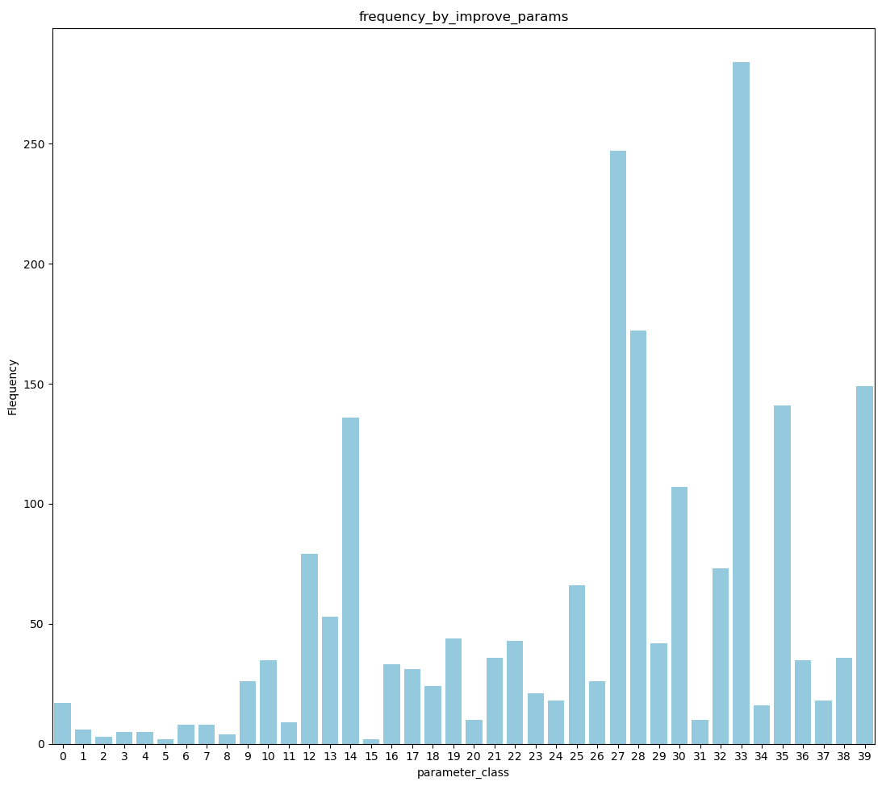
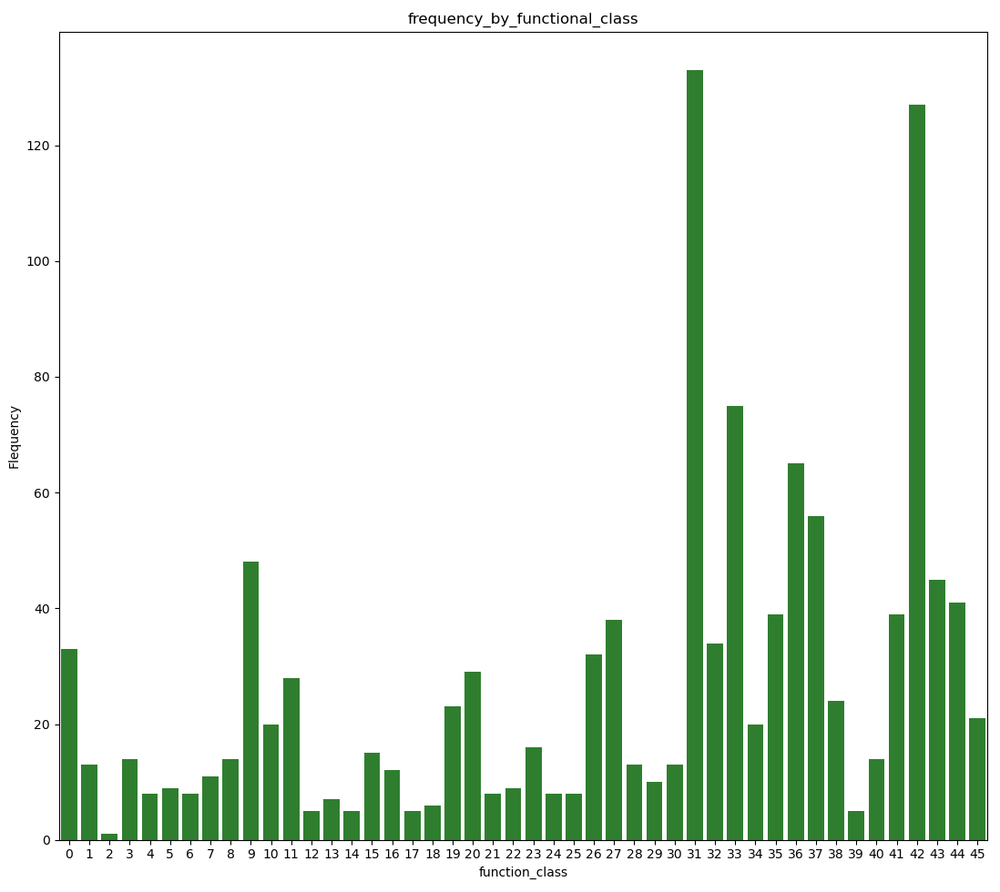

# AnalogiePatentFinder
解決したい問題と構造的に類似性のある問題を解決した特許を探し、その工夫をわかりやすく提示するアナロジー検索エンジン。

## demo video

## experimental data
- [8]より、GPT-4は専門的なデータでもアノテーションできることが示されているので、特許分野も同様にアノテーションできると考えた。したがって、GPT-4oを用いてクラス分けを行っている。
- どちらも、各クラスの頻度が一様で無いことは明らかである。
- これは、使用した分類の真の分布が一様でないのか、GPTの持つバイアスによるものなのかはわからない。  
しかし、よりアナロジーへの貢献が見込まれる結果を表示するためには、どちらにしろ確率の高いクラスは細分化する必要があると感じている。
  

Explanation of the 39 Improvement Parameters [12]

A. Moving objects  
Objects which can easily change position in space, either on theirown, or as a result of external forces.Vehicles and objectsdesigned to be portable are the basic members of this class.  
B. Stationary objects  
Objects which do not change position in space, either on theirown, or as a result of external forces.Consider the conditionsunder which the object is being used.

1. Weight of moving object  
The mass of the object, in a gravitational field. The force that the body exerts on its support or suspension.
2. Weight of stationary object  
The mass of the object, in a gravitational field. The force that the body exerts on its support or suspension, or on the surface on which it rests.
3. Length of moving object  
Any one linear dimension, not necessarily the longest, is considered a length.
4. Length of stationary object  
Any one linear dimension, not necessarily the longest, is considered a length.
5. Area of moving object  
A geometrical characteristic described by the part of a plane enclosed by a line. The part of a surface occupied by the object. OR the square measure of the surface, either internal or external, of an object.
6. Area of stationary object  
A geometrical characteristic described by the part of a plane enclosed by a line. The part of a surface occupied by the object. OR the square measure of the surface, either internal or external, of an object.
7. Volume of moving object  
The cubic measure of space occupied by the object. Length x width x height for a rectangular object, height x area for a cylinder, etc.
8. Volume of stationary object  
The cubic measure of space occupied by the object. Length x width x height for a rectangular object, height x area for a cylinder, etc.
9. Speed  
The velocity of an object; the rate of a process or action in time.
10. Force  
Force measures the interaction between systems. In Newtonian physics, force = mass x acceleration. In TRIZ, force is any interaction that is intended to change an object’s condition.
11. Stress or pressure  
Force per unit area. Also, tension.
12. Shape  
The external contours, appearance of a system.
13. Stability of the object’s composition  
The wholeness or integrity of the system; the relationship of the system’s constituent elements. Wear, chemical decomposition, and disassembly are all decreases in stability. Increasing entropy is decreasing stability.
14. Strength  
The extent to which the object is able to resist changing in response to force. Resistance to breaking.
15. Duration of action by a moving object  
The time that the object can perform the action. Service life. Mean time between failure is a measure of the duration of action. Also, durability.
16. Duration of action by a stationary object  
The time that the object can perform the action. Service life. Mean time between failure is a measure of the duration of action. Also, durability.
17. Temperature  
The thermal condition of the object or system. Loosely includes other thermal parameters, such as heat capacity, that affect the rate of change of temperature.
18. Illumination intensity  
Light flux per unit area, also any other illumination characteristics of the system such as brightness, light quality, etc.
19. Use of energy by moving object  
The measure of the object’s capacity for doing work. In classical mechanics, Energy is the product of force x distance. This includes the use of energy provided by the super-system (such as electrical energy or heat). Energy required to do a particular job.
20. Use of energy by stationary object  
The measure of the object’s capacity for doing work. In classical mechanics, Energy is the product of force x distance. This includes the use of energy provided by the super-system (such as electrical energy or heat). Energy required to do a particular job.
21. Power  
The time rate at which work is performed. The rate of use of energy.
22. Loss of Energy  
Use of energy that does not contribute to the job being done. See 19. Reducing the loss of energy sometimes requires different techniques from improving the use of energy, which is why this is a separate category.  
23. Loss of substance  
Partial or complete, permanent or temporary, loss of some of a system’s materials, substances, parts or subsystems.
24. Loss of Information  
Partial or complete, permanent or temporary, loss of data or access to data in or by a system. Frequently includes sensory data such as aroma, texture, etc.
25. Loss of Time  
Time is the duration of an activity. Improving the loss of time means reducing the time taken for the activity. ‘Cycle time reduction’ is a common term.
26. Quantity of substance/the matter  
The number or amount of a system’s materials, substances, parts or subsystems which might be changed fully or partially, permanently or temporarily.
27. Reliability  
A system’s ability to perform its intended functions in predictable ways and conditions.
28. Measurement accuracy  
The closeness of the measured value to the actual value of a property of a system. Reducing the error in a measurement increases the accuracy of the measurement.
29. Manufacturing precision  
The extent to which the actual characteristics of the system or object match the specified or required characteristics.
30. External harm affects the object  
Susceptibility of a system to externally generated (harmful) effects.
31. Object-generated harmful factors  
A harmful effect is one that reduces the efficiency or quality of the functioning of the object or system. These harmful effects are generated by the object or system, as part of its operation.
32. Ease of manufacture  
The degree of facility, comfort or effortlessness in manufacturing or fabricating the object/system.
33. Ease of operation  
Simplicity: The process is not easy if it requires a large number of people, large number of steps in the operation, needs special tools, etc. ‘Hard’ processes have low yield and ‘easy’ processes have high yield; they are easy to do right.
34. Ease of repair  
Quality characteristics such as convenience, comfort, simplicity, and time to repair faults, failures or defects in a system.
35. Adaptability or versatility  
The extent to which a system/object positively responds to external changes. Also, a system that can be used in multiple ways for under a variety of circumstances.
36. Device complexity  
The number and diversity of elements and element interrelationships within a system. The user may be an element of the system that increases the complexity. The difficulty of mastering the system is a measure of its complexity.
37. Difficulty of detecting and measuring  
Measuring or monitoring systems that are complex, costly, require much time and labor to set up and use, or that have complex relationships between components or components that interfere with each other all demonstrate ‘difficulty of detecting and measuring.’ Increasing cost of measuring to a satisfactory error is also a sign of increased difficulty of measuring.
38. Extent of automation  
The extent to which a system or object performs its functions without human interface. The lowest level of automation is the use of a manually operated tool. For intermediate levels, humans program the tool, observe its operation, and interrupt or re-program as needed. For the highest level, the machine senses the operation needed, programs itself and monitors its own operations.
39. Productivity  
The number of functions or operations performed by a system per unit time. The time for a unit function or operation. The output per unit time, or the cost per unit output.

fig1: 向上パラメータでクラス分けしたときの、各クラスのfrequency
  

Explanation of the 45 abstract classes [9]

A. Branch
To cause a flow (material, energy, signal) to no longer be joined or mixed.

1. Separate  
 To isolate a flow (material, energy, signal) into distinct components.
 The separated components are distinct from the flow before separation, as well as each other.
 Example: A glass prism separates light into different wavelength components to produce a rainbow.

2. Divide  
 To separate a flow.
 Example: A vending machine divides the solid form of coins into appropriate denominations.

3. Extract  
 To draw, or forcibly pull out, a flow.
 Example: A vacuum cleaner extracts debris from the imported mixture and exports clean air to the environment.

4. Remove  
 To take away a part of a flow from its prefixed place.
 Example: A sander removes small pieces of the wood surface to smooth the wood.

5. Distribute  
 To cause a flow (material, energy, signal) to break up.
 The individual bits are similar to each other and the undistributed flow.
 Example: An atomizer distributes (or sprays) hair-styling liquids over the head to hold the hair in the desired style.

B. Channel
To cause a flow (material, energy, signal) to move from one location to another location.

6. Import  
 To bring in a flow (material, energy, signal) from outside the system boundary.
 Example: A physical opening at the top of a blender pitcher imports a solid (food) into the system. Also, a handle on the blender pitcher imports a human hand.

7. Export  
 To send a flow (material, energy, signal) outside the system boundary.
 Example: Pouring blended food out of a standard blender pitcher exports liquid from the system. The opening at the top of the blender is a solution to the export sub-function.

8. Transfer  
 To shift, or convey, a flow (material, energy, signal) from one place to another.

9. Transport  
 To move a material from one place to another.
 Example: A coffee maker transports liquid (water) from its reservoir through its heating chamber and then to the filter basket.

10. Transmit  
 To move energy from one place to another.
 Example: In a hand-held power sander, the housing of the sander transmits human force to the object being sanded.

11. Guide  
 To direct the course of a flow (material, energy, signal) along a specific path.
 Example: A domestic HVAC system guides gas (air) around the house to the correct locations via a set of ducts.

12. Translate  
 To fix the movement of a flow by a device into one linear direction.
 Example: In an assembly line, a conveyor belt translates partially completed products from one assembly station to another.

13. Rotate  
 To fix the movement of a flow by a device around one axis.
 Example: A computer disk drive rotates the magnetic disks around an axis so that the head can read data.

14. Allow degree of freedom (DOF)  
 To control the movement of a flow by a force external to the device into one or more directions.
 Example: To provide easy trunk access and close appropriately, trunk lids need to move along a specific degree of freedom. A four-bar linkage allows a rotational DOF for the trunk lid.

C. Connect
To bring two or more flows (material, energy, signal) together.

15. Couple  
 To join or bring together flows (material, energy, signal) such that the members are still distinguishable from each other.
 Example: A standard pencil couples an eraser and a writing shaft. The coupling is performed using a metal sleeve that is crimped to the eraser and the shaft.

16. Join  
 To couple flows together in a predetermined manner.
 Example: A ratchet joins a socket on its square shaft interface.

17. Link  
 To couple flows together by means of an intermediary flow.
 Example: A turnbuckle links two ends of a steering cable together.

18. Mix  
 To combine two flows (material, energy, signal) into a single, uniform homogeneous mass.
 Example: A shaker mixes a paint base and its dyes to form a homogeneous liquid.

D. Control magnitude
To alter or govern the size or amplitude of a flow (material, energy, signal).

19. Actuate  
 To commence the flow of energy, signal, or material in response to an imported control signal.
 Example: A circuit switch actuates the flow of electrical energy and turns on a light bulb.

20. Regulate  
 To adjust the flow of energy, signal, or material in response to a control signal, such as a characteristic of a flow.
 Example: Turning the valves regulates the flow rate of the liquid flowing from a faucet.

21. Increase  
 To enlarge a flow in response to a control signal.
 Example: Opening the valve of a faucet further increases the flow of water.

22. Decrease  
 To reduce a flow in response to a control signal.
 Example: Closing the valve further decreases the flow of propane to the gas grill.

23. Change  
 To adjust the flow of energy, signal, or material in a predetermined and fixed manner.
 Example: In a hand-held drill, a variable resistor changes the electrical energy flow to the motor, thus changing the speed at which the drill turns.

24. Increment  
 To enlarge a flow in a predetermined and fixed manner.
 Example: A magnifying glass increments the visual signal (i.e., the print) from a paper document.

25. Decrement  
 To reduce a flow in a predetermined and fixed manner.
 Example: The gear train of a power screwdriver decrements the flow of rotational energy.

26. Shape  
 To mold or form a flow.
 Example: In the auto industry, large presses shape sheet metal into contoured surfaces that become fenders, hoods, and trunks.

27. Condition  
 To render a flow appropriate for the desired use.
 Example: To prevent damage to electrical equipment, a surge protector conditions electrical energy by excluding spikes and noise (usually through capacitors) from the energy path.

28. Stop  
 To cease, or prevent, the transfer of a flow (material, energy, signal).
 Example: A reflective coating on a window stops the transmission of UV radiation through a window.

29. Prevent  
 To keep a flow from happening.
 Example: A submerged gate on a dam wall prevents water from flowing to the other side.

30. Inhibit  
 To significantly restrain a flow, though a portion of the flow continues to be transferred.
 Example: The structures of space vehicles inhibit the flow of radiation to protect crew and cargo.

E. Convert
To change from one form of a flow (material, energy, signal) to another.
For completeness, any type of flow conversion is valid. In practice, conversions such as converting electricity to torque will be more common than converting solid to optical energy.
Example: An electrical motor converts electricity to rotational energy.

31. Transformation  
 To convert a flow (material, energy, signal) from one form to another.
 Example: An electrical motor transforms electrical energy into rotational energy.

F. Provision
To accumulate or provide a material or energy flow.

32. Store  
 To accumulate a flow.
 Example: A DC electrical battery stores the energy in a flashlight.

33. Contain  
 To keep a flow within limits.
 Example: A vacuum bag contains debris vacuumed from a house.

34. Collect  
 To bring a flow together into one place.
 Example: Solar panels collect UV sun rays to power small mechanisms.

35. Supply  
 To provide a flow from storage.
 Example: In a flashlight, the battery supplies energy to the bulb.

G. Signal
To provide information on a material, energy, or signal flow as an output signal flow.
The information providing flow passes through the function unchanged.

36. Sense  
 To perceive, or become aware, of a flow.
 Example: An audiocassette machine senses if the end of the tape has been reached.

37. Detect  
 To discover information about a flow.
 Example: A gauge on the top of a gas cylinder detects proper pressure ranges.

38. Measure  
 To determine the magnitude of a flow.
 Example: An analog thermostat measures temperature through a bimetallic strip.

39. Indicate  
 To make something known to the user about a flow.
 Example: A small window in the water container of a coffee maker indicates the level of water in the machine.

40. Track  
 To observe and record data from a flow.
 Example: By tracking the performance of batteries, the low efficiency point can be determined.

41. Display  
 To reveal something about a flow to the mind or eye.
 Example: The xyz-coordinate display on a vertical milling machine displays the precise location of the cutting tool.

42. Process  
 To submit information to a particular treatment or method having a set number of operations or steps.
 Example: A computer processes a login request signal before allowing a user access to its facilities.

H. Support
To firmly fix a material into a defined location, or secure an energy or signal into a specific course.

43. Stabilize  
 To prevent a flow from changing course or location.
 Example: On a typical canister vacuum, the center of gravity is placed at a low elevation to stabilize the vacuum when it is pulled by the hose.

44. Secure  
 To firmly fix a flow path.
 Example: On a bicycling glove, a Velcro strap secures the human hand in the correct place.

45. Position  
 To place a flow (material, energy, signal) into a specific location or orientation.
 Example: The coin slot on a soda machine positions the coin to begin the coin evaluation and transportation procedure.

fig2: 抽象クラスでクラス分けしたときの、各クラスのfrequency

## 参考文献
1. L. Liu, Y. Li, Y. Xiong, and D. Cavallucci, “A new function-based patent knowledge retrieval tool for conceptual design of innovative products,” vol. 115, Nov. 2019, doi: 10.1016/j.compind.2019.103154.
2. H. B. Kang, X. Qian, T. Hope, D. Shahaf, J. Chan, and A. Kittur, “Augmenting Scientific Creativity with an Analogical Search Engine,” vol. 29, no. 6, p. 1, Nov. 2022, doi: 10.1145/3530013.
3. “特別企画 TRIZ で問題解決・課題達成！ ！-TRIZ の全体像と活用法.”
4. K. Gilon, J. Chan, F. Y. Ng, H. Liifshitz-Assaf, A. Kittur, and D. Shahaf, “Analogy Mining for Specific Design Needs,” Apr. 2018, doi: 10.1145/3173574.3173695.
5. H. B. Kang et al., “BIOSPARK: An End-to-End Generative System for Biological-Analogical Inspirations and Ideation.”
6. T. Hope, J. Chan, A. Kittur, and D. Shahaf, “Accelerating Innovation Through Analogy Mining,” Aug. 2017, doi: 10.1145/3097983.3098038.
7. L. Yu, R. E. Kraut, and A. Kittur, “Distributed Analogical Idea Generation with Multiple Constraints,” Feb. 2016, doi: 10.1145/2818048.2835201.
8. J. Savelka, K. D. Ashley, M. A. Gray, H. Westermann, and H. Xu, “Can GPT-4 Support Analysis of Textual Data in Tasks Requiring Highly Specialized Domain Expertise?”
9. J. Hirtz, R. B. Stone, D. A. Mcadams, S. Szykman, and K. L. Wood, “A functional basis for engineering design: Reconciling and evolving previous efforts,” vol. 13, no. 2, p. 65, Feb. 2002, doi: 10.1007/s00163-001-0008-3.
10. L. Yu, A. Kittur, and R. E. Kraut, “Searching for analogical ideas with crowds,” Apr. 2014, doi: 10.1145/2556288.2557378.
11. L. Yu, A. Kittur, and R. E. Kraut, “Distributed analogical idea generation,” Apr. 2014, doi: 10.1145/2556288.2557371.
12. Karen Gadd,"TRIZ for Engineers: Enabling Inventive Problem Solving",March 2011,doi: 10.1002/9780470684320
